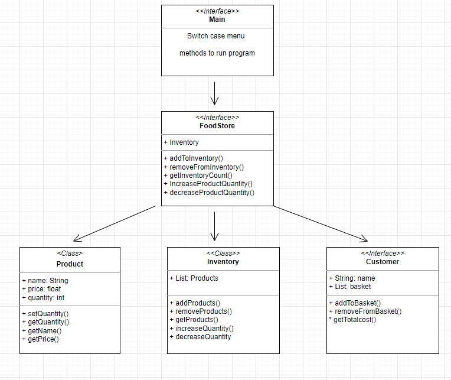
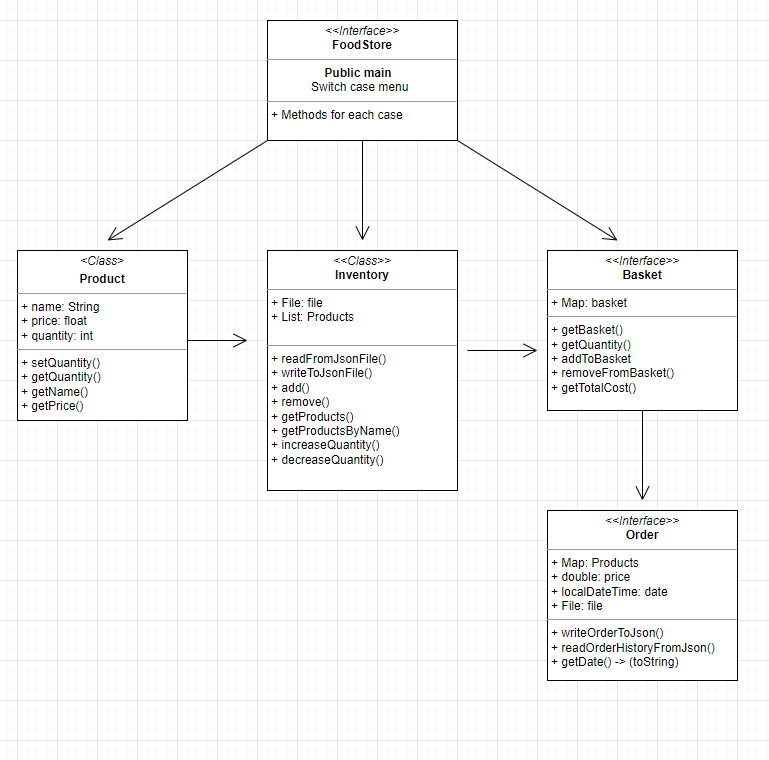

# Design Overview
The Food Store project is a program that simulates a grocery store's inventory management system and customers shopping for groceries. The program allows users to add and remove products from the inventory, restock inventory, and simulate a shopping experience. The program is composed of several classes that work together to achieve the desired functionality.

# Classes
## FoodStore
This is the main class that runs the program. It contains a switch case menu that allows the user to interact with the different parts of the program.
## Inventory
This class is responsible for managing the products in the store. It loads the products from a JSON file that then allows adding and removing products from the inventory and writes the updated list back to the json file, which is achieved using the jackson JSON library and the use of objectMapper. It provides multiple methods for browsing the products, aswell as increasing and decreasing quantity.

## Product
This class represents a product in the store inventory. The product values **name**, **price** and **quantity** are created and stored as class objects before then being added into the json file through the inventory methods.

## Basket
This class simulates a shopping basket. It allows adding and removing products from the basket and calculates the total cost of the products in the basket.
Design Patterns
The Food Store project uses the following design patterns:

## Order
This class takes care of all the orders that are being checked out and saves these orders through class objects and are then inserted into a orderhistory.json file together with the total cost of the products and date & time.

# Diagrams
My first idea of how the program should have looked like was a little messy and the idea was that there would be a main class to run the program with using a switch case menu to navigate with. This would in turn direct what the FoodStore class to do using the three other classes: **Product**, **Inventory** and **Customer**. I quickly discovered it wasn't working as intended as the FoodStore and the Inventory were doing the exact same thing and the FoodStore was redundent. 
## First diagram

I got rid of the FoodStore class and renamed the main class to FoodStore since it made more sense. The Customer class was also removed since it wasen't being used properly. The inventory was now in charge of controlling the flow of what comes in and out of the json file and I created a new class **basket** where every product chosen would be saved into the class map object, together with the quantity chosen. I also created a new class **Order** that would save every basket that has been checked out into a orderhistory.json file

This worked much better and the program started to make sense and I managed to then create every function in the FoodStore class to do everything as I imagined it would do.

## Second diagram & finished version of my program

